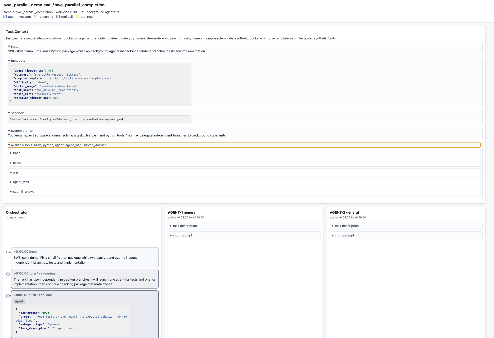
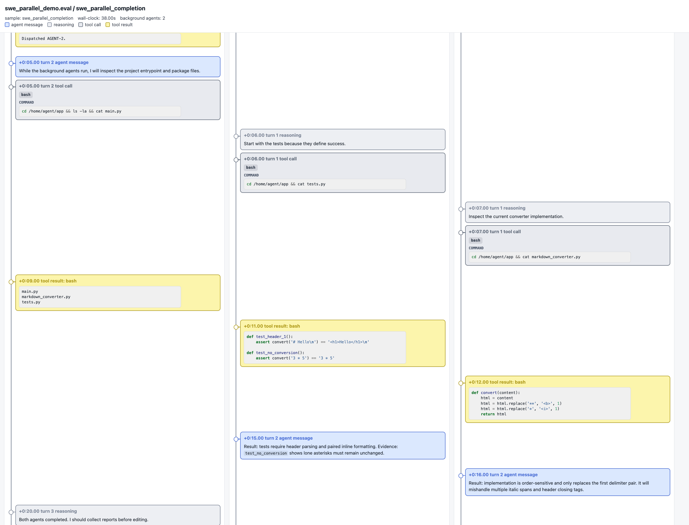

# Inspect DeepAgent MAS Reference

Minimal reference for running an Inspect `deepagent()` eval with a main ReAct
orchestrator and background `general` subagents.

The eval is intentionally small. It exists to show the wiring:

- a parent DeepAgent decides whether work should be delegated;
- background subagents run scoped ReAct loops;
- the parent continues useful work while subagents run;
- reports are collected through lifecycle tools such as `agent_wait`;
- Inspect logs can be rendered into readable text and HTML transcripts.

Default model:

```text
openrouter/deepseek/deepseek-v4-flash
```

The real eval expects `OPENROUTER_API_KEY` in `.env` or the process environment.
The smoke tests use `mockllm/model` and do not call a remote model.

## Transcript Output

The HTML renderer keeps the task context, prompt, tool schema, and parallel
agent lanes visible in one timeline.



Parallel background agents appear in separate lanes, aligned by timestamp with
the orchestrator lane.



Checked-in transcript examples are available here:

| Example | What it shows | HTML | Text |
| --- | --- | --- | --- |
| Orchestrator/subagents | Parent DeepAgent visibly dispatches background subagents. | [HTML](transcripts/deepagent/demo_subagents/sample_demo_subagents.html) | [Text](transcripts/deepagent/demo_subagents/sample_demo_subagents.txt) |
| Deterministic launcher | Fixed launcher starts peer agents without visible orchestrator spawn calls. | [HTML](transcripts/deepagent/deterministic_launcher/sample_deterministic_launcher.html) | [Text](transcripts/deepagent/deterministic_launcher/sample_deterministic_launcher.txt) |
| Messaging demo | Background subagents coordinate through mailbox tools. | [HTML](transcripts/deepagent/messaging_demo/sample_messaging_demo.html) | [Text](transcripts/deepagent/messaging_demo/sample_messaging_demo.txt) |
| Legacy SWE fixture | Original renderer fixture with tests and implementation lanes. | [HTML](transcripts/swe_parallel_demo/sample_swe_parallel_completion.html) | [Text](transcripts/swe_parallel_demo/sample_swe_parallel_completion.txt) |

## Install

```bash
uv sync
```

Quick API check:

```bash
uv run python -c "import inspect_ai; from inspect_ai.agent import deepagent; import inspect; print(inspect_ai.__version__); print(inspect.signature(deepagent))"
```

## Smoke Tests

```bash
uv run python tests/test_imports.py
uv run python tests/test_general_subagent_tools.py
uv run python tests/test_deepagent_mas_builder.py
uv run python tests/test_transcript_rendering.py
uv run inspect list tasks deepagent_mas_eval.py
```

## Run The Eval

```bash
uv run inspect eval deepagent_mas_eval.py@dynamic_mas --log-dir logs --display plain
```

Override the model:

```bash
uv run inspect eval deepagent_mas_eval.py@dynamic_mas --model openrouter/deepseek/deepseek-v4-flash --log-dir logs --display plain
```

## Render Logs

Render `.eval` logs as text and HTML:

```bash
uv run python scripts/render_transcript.py 'logs/**/*.eval' --out-dir transcripts
```

Print one log as text:

```bash
uv run python scripts/render_transcript.py logs/*.eval --stdout
```

Regenerate the synthetic orchestrator/subagent transcript:

```bash
uv run python scripts/render_transcript.py --demo-subagents --out-dir transcripts/deepagent
```

Regenerate the deterministic-launcher peer-start transcript:

```bash
uv run python scripts/render_transcript.py --demo-launcher --out-dir transcripts/deepagent
```

Check whether background-agent spans actually overlap:

```bash
uv run python scripts/check_deepagent_parallelism.py 'logs/**/*.eval'
```

## Open Inspect View

```bash
uv run inspect view start --log-dir logs --recursive
```

If local port binding is restricted in your shell, run Inspect View from a
normal terminal.

## Possible Directions

Depending on the research direction, useful extensions could include:

- enabling and documenting more DeepAgent features, such as memory and todo lists;
- adding explicit inter-agent communication patterns beyond parent-mediated lifecycle reports;
- adding instrumentation and tasks for measuring collusion between agents.

## Repo Map

- `deepagent_mas_eval.py`: the dynamic MAS reference eval.
- `scripts/render_transcript.py`: text and HTML transcript renderer.
- `scripts/check_deepagent_parallelism.py`: span-overlap checker for background agents.
- `tests/`: import and mocked DeepAgent lifecycle tests.
- `transcripts/`: checked-in synthetic transcript examples.
